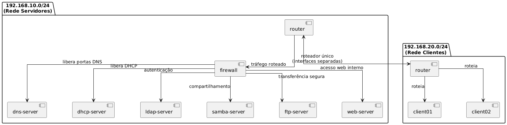

# Implementação de Serviços de Gestão de Redes de Computadores em Docker

## Instituto Federal Goiano – Câmpus Ceres
**Curso:** Bacharelado em Sistemas de Informação  
**Disciplina:** Gestão de Redes de Computadores  
**Semestre:** 2025/01  
**Data da Entrega:** 29/04/2025
</br>
**Turma:** Serviços de Redes de Computadores - 5° Período  
**Valor:** 5 Pontos  
**Professor:** Roitier Campos Gonçalves

**Autores:** Carlos Henrique Alves, Felipe Gomes, Iago José, Victor Augusto
# Projeto de Infraestrutura de Rede Corporativa com Docker

## Objetivo
Implementar uma infraestrutura de rede corporativa básica utilizando Docker, integrando serviços essenciais como:
- DNS
- DHCP
- Firewall
- SAMBA
- Web Server (Apache/NGINX)

---

## Escopo do Projeto

## Escopo do Projeto

### 1. Serviços Básicos de Rede
- **DNS (Bind9 ou dnsmasq):**
  - Resolução de nomes local.
  - Zonas forward e reverse.
- **DHCP (ISC DHCP ou dhcpd):**
  - Atribuição automática de IPs.
  - Reservas de IPs fixos.
- **Firewall (iptables/nftables ou UFW):**
  - Filtro de tráfego.
  - Permitir apenas serviços essenciais.
- **SAMBA:**
  - Compartilhamento de arquivos.
  - Autenticação integrada com LDAP.
- **Web Server (Apache ou NGINX):**
  - Página interna e virtual hosts.

### 2. Requisitos Técnicos
- Docker obrigatório
- Duas sub-redes (ex: 192.168.1.0/24 e 192.168.2.0/24)
- Container roteador entre sub-redes e internet
- Sugestão: uso de Ansible para automação

---

## Etapas do Projeto

### Fase 1 Configuração dos Serviços
- Cada serviço em container próprio
- Segurança e integração entre serviços

### Fase 2: Testes e Integração
- Comunicação entre containers e sub-redes
- Validação de DNS, DHCP, Firewall, LDAP, SAMBA, FTP, Web

### Fase 3: Documentação e Automação
- Relatório técnico com configurações
- Diagrama de rede
- Publicação no GitHub
- Apresentação

---

## Topologia de Rede


### Sub-redes
- `192.168.10.0/24` - Servidores
- `192.168.20.0/24` - Clientes

### Containers Previstos
| Container        | Função                    | IP              | Rede        |
|------------------|----------------------------|------------------|-------------|
| router           | Roteador                  | 192.168.10.1 / 192.168.20.1 | Ambas |
| dns-server       | DNS interno               | 192.168.10.2     | Servidores  |
| dhcp-server      | DHCP                      | 192.168.10.3     | Servidores  |
| firewall         | Firewall                  | 192.168.10.253   | Servidores  |
| samba-server     | Compartilhamento de arquivos | 192.168.10.5  | Servidores  |
| web-server       | Web Server                | 192.168.10.20    | Servidores  |
| client01         | Cliente                   | DHCP (ex: 192.168.20.100)  | Clientes    |

---

## Domínio Interno e DNS
- Domínio: `corp.local`

| Nome   | FQDN                | IP             |
|--------|----------------------|----------------|
| DNS    | dns.corp.local      | 192.168.10.2   |
| DHCP   | dhcp.corp.local     | 192.168.10.3   |
| SAMBA  | files.corp.local    | 192.168.10.5   |
| Web    | intranet.corp.local | 192.168.10.20  |
| Firewall | firewall.corp.local | 192.168.10.253 |

---

## Estrutura de Usuários (LDAP)
- **Base DN:** `dc=corp,dc=local`
- **Grupos:** `admins`, `developers`, `finance`, `guests`

| Nome  | UID   | Grupo      |
|--------|--------|------------|
| Alice  | alice  | admins     |
| Bob    | bob    | developers |
| Carol  | carol  | finance    |
| Dave   | dave   | guests     |

**Permissões:**
- Login via LDAP
- Acesso a SAMBA conforme grupo
- FTP se autorizado
- Autenticação no Web Server (opcional)

## Como Testar Todos os Serviços e Validar a Configuração

### 1. Router (Verificação de Roteamento)

### 2. DNS (Bind9 ou dnsmasq)

### 3. DHCP (ISC DHCP ou dhcpd)

### 4. Firewall (iptables/nftables ou UFW)

### 5. SAMBA (Compartilhamento de Arquivos)

**Comandos de teste:**
```bash
# Verificar status do serviço
docker exec samba-server ps aux | grep smb

# Listar compartilhamentos
# Acesso público (sem autenticação LDAP)
docker exec client01 smbclient -L //files.corp.local -N

docker exec client01 smbclient //files.corp.local/public -N -c 'ls'
```

**Validação de sucesso:**
- Serviço Samba está rodando
- Compartilhamentos aparecem na listagem
- Acesso ao compartilhamento público funciona

### 6. Web Server (Apache ou NGINX)

**Comandos de teste:**
```bash
# Verificar status do serviço
# Para NGINX:
docker exec web-server ps aux | grep nginx
# Para Apache:
docker exec web-server ps aux | grep apache

# Testar acesso HTTP
docker exec client01 curl http://intranet.corp.local

# Verificar configuração
# Para NGINX:
docker exec web-server nginx -t
# Para Apache:
docker exec web-server apachectl -t
```

**Validação de sucesso:**
- Serviço web está rodando
- Página intranet é acessível
- Virtual hosts respondem corretamente

### 7. Verificação de Integração

**Comandos de teste:**
```bash
# Testar resolução DNS + acesso a recurso Samba
docker exec client01 smbclient -L //files.corp.local -N

docker exec client01 curl http://intranet.corp.local
```

## Execução Final
O projeto deve ser implantável com **um único comando**, utilizando scripts ou playbooks para provisionamento automatizado da infraestrutura em Docker.

