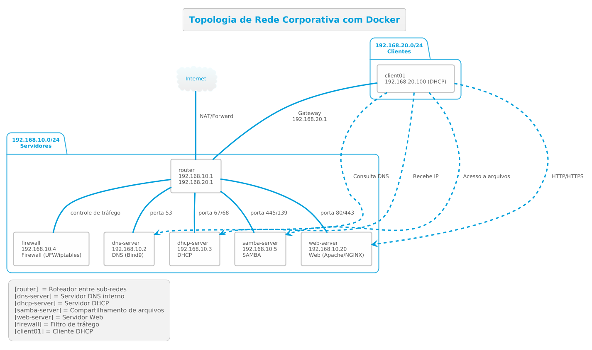

# Implementação de Serviços de Gestão de Redes de Computadores em Docker

## Instituto Federal Goiano – Câmpus Ceres
**Curso:** Bacharelado em Sistemas de Informação  
**Disciplina:** Gestão de Redes de Computadores  
**Semestre:** 2025/01  
**Data da Entrega:** 29/04/2025
**Turma:** Serviços de Redes de Computadores - 5° Período  
**Valor:** 5 Pontos  
**Professor:** Roitier Campos Gonçalves

**Autores:** Carlos Henrique Alves, Felipe Gomes, Iago José, Victor Augusto
# Projeto de Infraestrutura de Rede Corporativa com Docker

## Objetivo
Implementar uma infraestrutura de rede corporativa básica utilizando Docker, integrando serviços essenciais como:
- DNS
- DHCP
- Firewall
- LDAP
- SAMBA
- FTP
- Web Server (Apache/NGINX)

---

## Escopo do Projeto

## Escopo do Projeto

### 1. Serviços Básicos de Rede
- **DNS (Bind9 ou dnsmasq):**
  - Resolução de nomes local.
  - Zonas forward e reverse.
- **DHCP (ISC DHCP ou dhcpd):**
  - Atribuição automática de IPs.
  - Reservas de IPs fixos.
- **Firewall (iptables/nftables ou UFW):**
  - Filtro de tráfego.
  - Permitir apenas serviços essenciais.
- **LDAP (OpenLDAP ou 389 Directory Server):**
  - Autenticação centralizada.
  - Criação de usuários e grupos.
- **SAMBA:**
  - Compartilhamento de arquivos.
  - Autenticação integrada com LDAP.
- **FTP (vsftpd ou ProFTPD):**
  - FTP seguro (SFTP/FTPS).
- **Web Server (Apache ou NGINX):**
  - Página interna e virtual hosts.

### 2. Requisitos Técnicos
- Docker obrigatório
- Duas sub-redes (ex: 192.168.1.0/24 e 192.168.2.0/24)
- Container roteador entre sub-redes e internet
- Sugestão: uso de Ansible para automação

---

## Etapas do Projeto

### Fase 1 Configuração dos Serviços
- Cada serviço em container próprio
- Segurança e integração entre serviços

### Fase 2: Testes e Integração
- Comunicação entre containers e sub-redes
- Validação de DNS, DHCP, Firewall, LDAP, SAMBA, FTP, Web

### Fase 3: Documentação e Automação
- Relatório técnico com configurações
- Diagrama de rede
- Publicação no GitHub
- Apresentação

---

## Topologia de Rede


### Sub-redes
- `192.168.10.0/24` - Servidores
- `192.168.20.0/24` - Clientes

### Containers Previstos
| Container        | Função                    | IP              | Rede        |
|------------------|----------------------------|------------------|-------------|
| router           | Roteador                  | 192.168.10.1 / 192.168.20.1 | Ambas |
| dns-server       | DNS interno               | 192.168.10.2     | Servidores  |
| dhcp-server      | DHCP                      | 192.168.10.3     | Servidores  |
| firewall         | Firewall                  | N/A              | N/A         |
| ldap-server      | Autenticação centralizada | 192.168.10.4     | Servidores  |
| samba-server     | Compartilhamento de arquivos | 192.168.10.5  | Servidores  |
| ftp-server       | FTP seguro                | 192.168.10.6     | Servidores  |
| web-server       | Web Server                | 192.168.10.7     | Servidores  |
| client01         | Cliente                   | DHCP (ex: .100)  | Clientes    |
| client02         | Cliente                   | DHCP (ex: .101)  | Clientes    |

---

## Domínio Interno e DNS
- Domínio: `corp.local`

| Nome   | FQDN                | IP             |
|--------|----------------------|----------------|
| DNS    | dns.corp.local      | 192.168.10.2   |
| DHCP   | dhcp.corp.local     | 192.168.10.3   |
| LDAP   | ldap.corp.local     | 192.168.10.4   |
| SAMBA  | files.corp.local    | 192.168.10.5   |
| FTP    | ftp.corp.local      | 192.168.10.6   |
| Web    | intranet.corp.local | 192.168.10.7   |

---

## Estrutura de Usuários (LDAP)
- **Base DN:** `dc=corp,dc=local`
- **Grupos:** `admins`, `developers`, `finance`, `guests`

| Nome  | UID   | Grupo      |
|--------|--------|------------|
| Alice  | alice  | admins     |
| Bob    | bob    | developers |
| Carol  | carol  | finance    |
| Dave   | dave   | guests     |

**Permissões:**
- Login via LDAP
- Acesso a SAMBA conforme grupo
- FTP se autorizado
- Autenticação no Web Server (opcional)

---

## Como Testar Todos os Serviços e Validar a Configuração

Esta seção fornece instruções para testar cada componente da infraestrutura e verificar seu funcionamento correto.

### 1. Router (Verificação de Roteamento)

**Comandos de teste:**
```bash
# Verificar tabela de roteamento
docker exec router ip route

# Testar conectividade entre sub-redes
docker exec client01 ping -c 4 192.168.10.7

# Testar conectividade com a internet
docker exec client01 ping -c 4 8.8.8.8
```

**Validação de sucesso:**
- Containers de diferentes sub-redes conseguem se comunicar
- Pacotes são corretamente encaminhados entre 192.168.10.0/24 e 192.168.20.0/24
- Conexão com internet funciona (se configurada)

### 2. DNS (Bind9 ou dnsmasq)

**Comandos de teste:**
```bash
# Testar resolução de nomes internos
docker exec client01 nslookup dns.corp.local
docker exec client01 nslookup ldap.corp.local

# Testar resolução de nomes externos
docker exec client01 nslookup google.com

# Verificar configuração do servidor DNS
docker exec dns-server named-checkconf
```

**Validação de sucesso:**
- Nomes internos são resolvidos para os IPs corretos
- Nomes externos são resolvidos (se forwarding configurado)
- Registros DNS correspondem à tabela planejada

### 3. DHCP (ISC DHCP ou dhcpd)

**Comandos de teste:**
```bash
# Verificar IP recebido via DHCP
docker exec client01 ip addr show

# Verificar logs do servidor DHCP
docker exec dhcp-server cat /var/log/dhcpd.log
# ou
docker logs dhcp-server

# Forçar renovação de IP
docker exec client01 dhclient -r && docker exec client01 dhclient
```

**Validação de sucesso:**
- Clientes recebem automaticamente IPs da faixa 192.168.20.0/24
- Logs mostram solicitações DHCP atendidas
- Gateway e DNS são corretamente configurados nos clientes

### 4. Firewall (iptables/nftables ou UFW)

**Comandos de teste:**
```bash
# Verificar regras de firewall
docker exec firewall iptables -L -n -v
# ou
docker exec firewall nft list ruleset

# Testar bloqueio (deve falhar se o firewall funcionar)
docker exec client01 telnet 192.168.10.7 22

# Testar permissão (deve funcionar)
docker exec client01 curl http://intranet.corp.local
```

**Validação de sucesso:**
- Regras definidas estão ativas
- Serviços não permitidos são bloqueados
- Serviços permitidos estão acessíveis
- Logs mostram tentativas bloqueadas

### 5. LDAP (OpenLDAP ou 389 Directory Server)

**Comandos de teste:**
```bash
# Verificar status do serviço
docker exec ldap-server ps aux | grep ldap

# Listar usuários/entradas
docker exec ldap-server ldapsearch -x -H ldap://ldap.corp.local \
  -b "dc=corp,dc=local" -D "cn=admin,dc=corp,dc=local" -w senha

# Testar autenticação
docker exec client01 ldapwhoami -x -H ldap://ldap.corp.local \
  -D "uid=alice,ou=users,dc=corp,dc=local" -w senha_alice
```

**Validação de sucesso:**
- Serviço LDAP está rodando
- Consulta retorna usuários e grupos esperados
- Autenticação funciona com credenciais corretas

### 6. SAMBA (Compartilhamento de Arquivos)

**Comandos de teste:**
```bash
# Verificar status do serviço
docker exec samba-server ps aux | grep smb

# Listar compartilhamentos
docker exec client01 smbclient -L //files.corp.local -U alice%senha_alice

# Acessar compartilhamento
docker exec -it client01 smbclient //files.corp.local/dados -U alice%senha_alice
```

**Validação de sucesso:**
- Serviço Samba está rodando
- Compartilhamentos aparecem na listagem
- Acesso funciona com credenciais válidas
- Permissões de grupos são respeitadas

### 7. FTP (vsftpd ou ProFTPD)

**Comandos de teste:**
```bash
# Verificar status do serviço
docker exec ftp-server ps aux | grep ftp

# Testar conexão FTP
docker exec client01 ftp -n ftp.corp.local << EOF
user alice senha_alice
ls
quit
EOF

# Testar upload/download
docker exec client01 bash -c "echo 'teste' > arquivo.txt && \
  ftp -n ftp.corp.local << EOF
user alice senha_alice
put arquivo.txt
get arquivo.txt arquivo2.txt
quit
EOF"
```

**Validação de sucesso:**
- Serviço FTP está rodando
- Login aceito com credenciais LDAP
- Listagem, upload e download funcionam
- Transferências são seguras (SFTP/FTPS)

### 8. Web Server (Apache ou NGINX)

**Comandos de teste:**
```bash
# Verificar status do serviço
docker exec web-server ps aux | grep apache
# ou
docker exec web-server ps aux | grep nginx

# Testar acesso HTTP
docker exec client01 curl http://intranet.corp.local
# Com autenticação (se configurada)
docker exec client01 curl --user alice:senha_alice http://intranet.corp.local

# Verificar configuração
docker exec web-server apachectl -t
# ou
docker exec web-server nginx -t
```

**Validação de sucesso:**
- Serviço web está rodando
- Página intranet é acessível
- Virtual hosts respondem corretamente
- Autenticação funciona (se configurada)

### 9. Verificação de Integração

**Comandos de teste:**
```bash
# Testar resolução DNS + autenticação + acesso a recurso
docker exec client01 smbclient -L //files.corp.local -U alice%senha_alice

# Acesso a website usando FQDN
docker exec client01 curl http://intranet.corp.local

# Verificar autenticação LDAP
docker exec client01 id alice
```

## Execução Final
O projeto deve ser implantável com **um único comando**, utilizando scripts ou playbooks para provisionamento automatizado da infraestrutura em Docker.